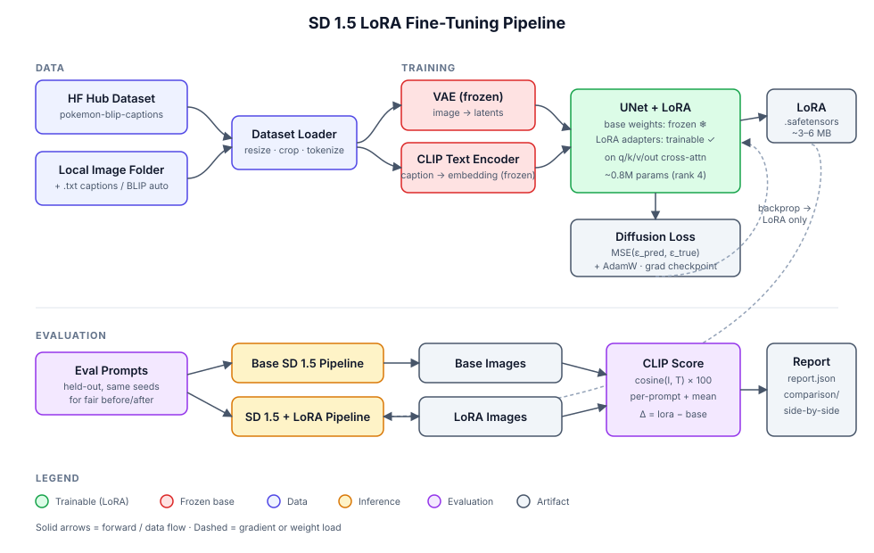

# Stable Diffusion 1.5 — LoRA Fine-Tuning Pipeline

End-to-end pipeline for fine-tuning Stable Diffusion 1.5 with **LoRA** adapters on a small custom dataset, plus a **CLIP-score evaluation harness** that compares the base model against the fine-tuned model on a held-out prompt set.

Built on 🤗 **Diffusers**, **PEFT**, **Accelerate**, and **PyTorch**. Runs locally on an 8 GB+ NVIDIA GPU or on a free Colab T4.

---

## Architecture



**Why LoRA?** A LoRA adapter on the UNet's cross-attention projections trains only ~0.5–1 M parameters (vs. ~860 M for full fine-tuning), produces a 3–6 MB checkpoint, runs on 8 GB VRAM, and preserves the base model's generality so it can be swapped in or out without re-downloading anything.

---

## Repo layout

```
sd-lora-finetune/
├── src/
│   ├── dataset.py        # HF hub + local-folder loaders, BLIP auto-captioning
│   ├── train.py          # LoRA injection (PEFT), accelerate-based training loop
│   ├── inference.py      # Pipeline loader + generate() helper
│   └── evaluate.py       # CLIP scoring, base vs LoRA comparison
├── scripts/
│   ├── train_lora.py     # CLI: training entrypoint
│   ├── generate.py       # CLI: single-prompt inference
│   └── evaluate.py       # CLI: before/after CLIP eval
├── configs/
│   ├── default.yaml      # All training hyperparameters
│   └── eval_prompts.txt  # Held-out evaluation prompts
├── notebooks/
│   └── colab_quickstart.ipynb
├── tests/
│   └── test_smoke.py     # Offline sanity checks
└── docs/images/
    └── architecture.svg
```

---

## Quickstart

### 1. Install

```bash
git clone https://github.com/YOUR_USERNAME/sd-lora-finetune.git
cd sd-lora-finetune

# Install PyTorch matching your CUDA version (example: CUDA 12.1)
pip install torch torchvision --index-url https://download.pytorch.org/whl/cu121

pip install -r requirements.txt
pip install xformers  # optional, recommended on CUDA
```

### 2. Smoke test (no GPU, no downloads)

```bash
python tests/test_smoke.py
```

### 3. Train on the public demo dataset

```bash
python scripts/train_lora.py --config configs/default.yaml
```

This trains a Pokémon-style LoRA on the `lambdalabs/pokemon-blip-captions` dataset (~833 images). On a single RTX 3060 (8 GB) at default settings, ~1000 steps take roughly 30 minutes.

### 4. Train on your own images

Put images (and optional `<name>.txt` caption files) in a folder:

```bash
python scripts/train_lora.py --config configs/default.yaml \
  dataset.name=null \
  dataset.image_dir=data/raw/my_concept \
  dataset.instance_prompt="a photo of sks dog" \
  dataset.auto_caption=false \
  training.num_train_epochs=100
```

Set `dataset.auto_caption=true` to caption images automatically with BLIP.

### 5. Generate images with the trained LoRA

```bash
python scripts/generate.py \
  --prompts "a green dragon pokemon with red eyes" "a small pink pokemon with big ears" \
  --lora outputs/checkpoints/lora_run/lora/lora_step_001000.safetensors \
  --out outputs/samples/gen
```

### 6. Evaluate base vs LoRA with CLIP score

```bash
python scripts/evaluate.py \
  --lora outputs/checkpoints/lora_run/lora/lora_step_001000.safetensors \
  --prompts-file configs/eval_prompts.txt
```

Output:

- `outputs/eval/base/` — base SD images
- `outputs/eval/lora/` — fine-tuned model images (same prompts, same seed)
- `outputs/eval/comparison/` — side-by-side PNGs
- `outputs/eval/report.json` — per-prompt + mean CLIP score, plus delta

---

## Training steps in detail

1. **Load components** — VAE, text encoder, UNet, scheduler from `runwayml/stable-diffusion-v1-5`.
2. **Freeze everything**, then inject PEFT LoRA adapters (`rank=4`, `α=4`) into the UNet's cross-attention `to_q`, `to_k`, `to_v`, `to_out.0` projections.
3. **Encode each batch**: images → VAE latents (×0.18215); captions → CLIP text embeddings.
4. **Diffusion objective**: sample noise ε and a random timestep t, form `x_t = √ᾱ_t · x_0 + √(1−ᾱ_t) · ε`, predict ε̂ with the UNet, optimize `MSE(ε̂, ε)`.
5. **Periodic validation** — sample held-out prompts every N steps with the live LoRA adapter; save under `outputs/checkpoints/.../samples/step_<N>/`.
6. **Checkpoint** — save the PEFT state-dict as a small `.safetensors` file (~3–6 MB).

Mixed-precision (fp16), gradient checkpointing, and xformers attention are on by default. AdamW with constant LR `1e-4` is a solid starting point; reduce to `5e-5` for larger datasets, raise the LoRA `rank` (8–16) for more capacity at the cost of file size.

---

## Evaluation methodology

**CLIP score** measures how well a generated image matches its prompt: the cosine similarity between CLIP image and text embeddings, multiplied by 100. Higher is better. Implementation: `openai/clip-vit-base-patch32`.

The evaluator generates images with the **base model** and the **LoRA-adapted model** on identical prompts and identical seeds, then computes CLIP score for each, plus the per-prompt and mean delta. Side-by-side PNGs make qualitative inspection trivial.

**Limitations.** CLIP score rewards semantic alignment, not fidelity to a specific style. After domain-specific fine-tuning, CLIP score on the **target domain's prompts** may rise (better stylistic match) or fall slightly (less generic compositions) — pair it with visual inspection of the comparison grids. For style fine-tuning, also consider FID against a held-out set of real images from the target domain.

---

## Results

Paste your numbers and comparison grids here after a run, e.g.:

| Metric                   | Base SD 1.5 | + LoRA (1000 steps) | Δ      |
| ------------------------ | ----------: | ------------------: | -----: |
| Mean CLIP score (n=8)    | 33.98       | 33.41               | -0.57  |
| Checkpoint size          |       3.4 GB |              ~5 MB | −99.9% |
| VRAM peak (training)     |          —  |             ~7.5 GB |     —  |

`docs/images/comparison_example.png` — base (left) vs LoRA (right) on held-out prompts. ← drop in your own generated grid.

---

## Troubleshooting

- **OOM on 8 GB GPU.** Lower `dataset.resolution` to 384, keep `train_batch_size=1`, raise `gradient_accumulation_steps`, and confirm `mixed_precision: fp16` + `gradient_checkpointing: true`.
- **xformers fails to import.** It's optional — leave `training.enable_xformers=true`, the code falls back silently.
- **`safety_checker` warnings.** Disabled deliberately for evaluation — re-enable in `src/inference.py` if you redistribute generations.
- **CLIP score doesn't improve.** Train longer (≥1500 steps), increase LoRA `rank` (8–16), or check that your prompts actually describe your target domain.

---

## Tech stack

`diffusers` · `transformers` · `peft` · `accelerate` · `torch` · `torchvision` · `datasets` · `safetensors` · `omegaconf`

---

## License

MIT — see `LICENSE`. Stable Diffusion 1.5 weights are governed by their own [CreativeML Open RAIL-M license](https://huggingface.co/runwayml/stable-diffusion-v1-5).
